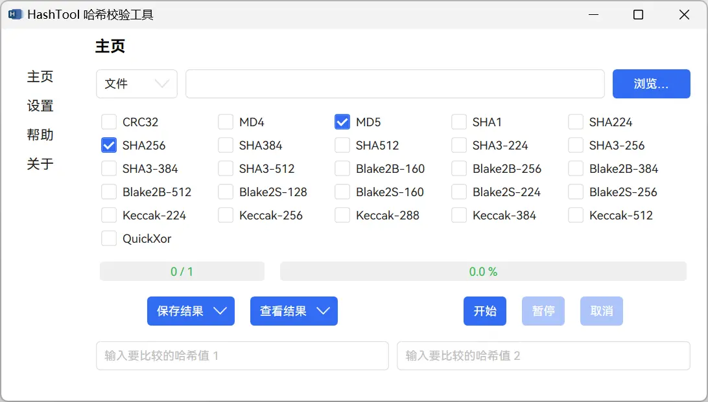

  

# HashTool

#### 用于计算和校验文件、文件夹或文本哈希值的工具！

#### A Tool for Calculating and Verifying the Hash Value of Any File, Folder, or Text!

---

HashTool 支持文件、文件夹或文本的哈希计算，选择多种算法时采用并行计算，此外还提供了结果导出和对比框校验功能。

**本项目不再进行功能更新，新项目 [DotVast.HashTool.WinUI](https://github.com/KiyanYang/DotVast.HashTool.WinUI)。**

## 环境

- `.NET 6.0 Desktop Runtime - Windows x64` [点击下载](https://dotnet.microsoft.com/zh-cn/download)

## 使用

在 Releases 下载 `HashTool.zip` 或 `HashTool.7z` 解压后点击 `HashTool.exe` 运行。

Releases 链接：[`GitHub`](https://github.com/KiyanYang/HashTool/releases)；[`Gitee`](https://gitee.com/KiyanYang/HashTool/releases)。

> 更新功能通过 PowerShell 脚本实现，为了通过脚本[执行策略](https://docs.microsoft.com/zh-cn/powershell/module/microsoft.powershell.core/about/about_execution_policies?view=powershell-7.2)，本软件通过 `& powershell.exe -ExecutionPolicy Bypass -File ./updater.ps1` 命令执行 `Bypass` 执行策略，可能会被安全软件误报。

## 介绍

- **模式**：共有 3 种模式（文件、文件夹、文本）。其中“文件夹”模式下只会计算此文件夹内的文件，不会计算其子文件夹内的文件。
- **输入**：在上面的输入框输入“文件路径”、“文件夹路径”或“文本”，并选择相应模式进行计算。可以拖放“文件”或“文件夹”到此自动获取路径，也可以点击右上角“浏览…”按钮获取“路径”。
- **算法**：提供了多种算法（`CRC32`、`MD4`、`MD5`、`SHA1`、`SHA2 系列`、`SHA3 系列`、`Blake2B 系列`、`Blake2S 系列`、`Keccak 系列`、`QuickXor`）。
- **字符编码**：在文本模式下，可以选择文本的编码格式。
- **查看结果**：查看当前的计算结果，在“查看结果”按钮的下拉栏里有“查看历史结果”用来查看全部历史结果。
- **保存结果**：支持 4 种格式：`yaml`、`json`、`txt`和`xml`。在“保存结果”按钮的下拉栏里有“保存历史结果”用来保存全部历史结果。
- **对比**。在最下方的两个文本框输入哈希值自动对比，不区分大小写。
- **进度条**：主进度条显示计算当前任务进度，左侧副进度条用来显示总体任务进度。

## 感谢

- 工具

  - [Visual Studio Community 2022](https://visualstudio.microsoft.com/zh-hans/vs/community/)
  - [.NET 6](https://docs.microsoft.com/zh-cn/dotnet/api/?view=net-6.0)

- 项目

  - [dotnet/Runtime](https://github.com/dotnet/runtime)
  - [CommunityToolkit.Mvvm](https://github.com/CommunityToolkit/dotnet)
  - [HandyControl](https://github.com/HandyOrg/HandyControl)
  - [YamlDotNet](https://github.com/aaubry/YamlDotNet)
  - [HashLib4CSharp](https://github.com/Xor-el/HashLib4CSharp)

- 代码片段

  - [QuickXorHash.cs](https://gist.github.com/rgregg/c07a91964300315c6c3e77f7b5b861e4)
