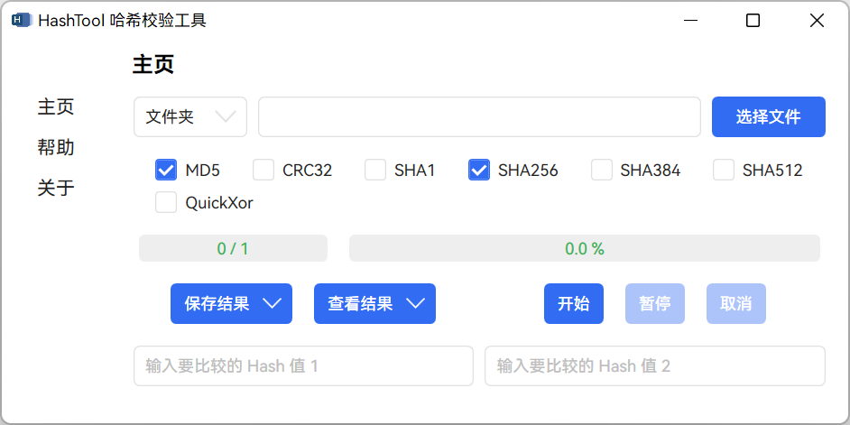

  

# HashTool

#### 用于计算和校验文件、文件夹或文本哈希值的工具！

#### A Tool for Calculating and Verifying the Hash Value of Any File, Folder, or Text!

---

HashTool 提供 3 种模式（文件、文件夹、文本）和 多种算法（`MD5`、`CRC32`、`SHA1`、`SHA256`、`SHA384`、`SHA512`、`QuickXor`）的哈希计算，对于文件采用并行计算（在选择多种算法时优势明显），同时也提供了对比框进行对比校验。

## 依赖环境

- `.NET 6` [点击下载](https://dotnet.microsoft.com/download/dotnet/thank-you/runtime-desktop-6.0.3-windows-x64-installer)

## 使用

在 Releases 下载 `HashTool.zip` 或 `HashTool.7z` 解压后点击 `HashTool.exe` 运行。

Releases 链接：[`GitHub`](https://github.com/KiyanYang/HashTool/releases)；[`Gitee`](https://gitee.com/KiyanYang/HashTool/releases)。

## 介绍

- **模式**：在左上角的下拉框中选择模式，一共有 3 种模式（文件、文件夹、文本）。其中“文件夹”模式下只会计算此文件夹所含的文件，不会计算其子文件夹内的文件，“文本”模式采用 `UTF-8` 编码进行计算。
- **输入**：在上面的输入框输入“文件路径”、“文件夹路径”或“文本”，并选择相应模式进行计算。可以拖放“文件”或“文件夹”到此自动获取路径，也可以点击右上角“选择文件”按钮获取“文件路径”。
- **算法**：提供了多种算法（`MD5`、`CRC32`、`SHA1`、`SHA256`、`SHA384`、`SHA512`、`QuickXor`）。默认为 `MD5` 和 `SHA256`。
- **查看结果**：在“查看结果”按钮的下拉栏里有“查看历史结果”用来查看全部历史结果。
- **保存结果**：有 3 种格式：`yaml`、`json`、`txt`。在“保存结果”按钮的下拉栏里有“保存历史结果”用来保存全部历史结果。
- **对比**。在最下方的两个文本框输入哈希值自动对比。
- **进度条**：主进度条显示计算当前任务进度，左侧副进度条用来显示总体任务进度。

## 感谢

- 工具

  - [Visual Studio Community 2022](https://visualstudio.microsoft.com/zh-hans/vs/community/)
  - [.NET 6](https://docs.microsoft.com/zh-cn/dotnet/api/?view=net-6.0)

- 项目

  - [Microsoft.Toolkit.Mvvm](https://github.com/CommunityToolkit/WindowsCommunityToolkit)
  - [HandyControl](https://github.com/HandyOrg/HandyControl)
  - [YamlDotNet](https://github.com/aaubry/YamlDotNet)
  - [SharpHash](https://github.com/ron4fun/SharpHash)
  - [crc](https://github.com/invertedtomato/crc)

- 代码片段

  - [QuickXorHash.cs](https://gist.github.com/rgregg/c07a91964300315c6c3e77f7b5b861e4)
